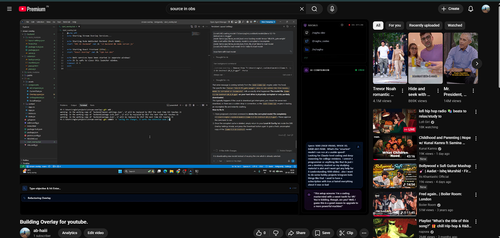
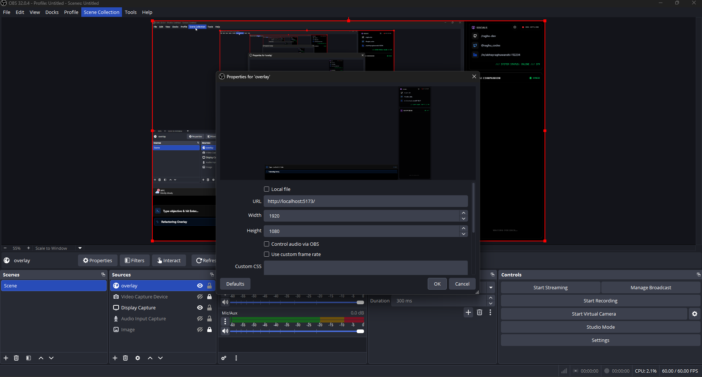

# AI Stream Overlay

Streamed while building it:  https://www.youtube.com/watch?v=EYx6zFFJDyE 




A high-tech, responsive, and data-driven OBS overlay built with React, Vite, TailwindCSS, and a dedicated Node.js backend. This overlay acts as an interactive dashboard for tech streams and includes an integrated, local **AI Co-host Chat Companion** powered by `node-llama-cpp`.

## Features

- **Interactive Layout Architecture**: Seamlessly scales and adapts to your streaming layout (16:9 1080p optimized).
- **OBS Socket Integration**: Listens for OBS recording/connection states and provides visual indicators.
- **Dynamic Camera Hub**: Easily toggle Face, Hand, and Room cameras natively through the overlay UI. Preferences are saved automatically via the local backend across reloads.
- **Local AI Companion**: A built-in chat box widget that interacts with the audience or stream events in real time.
- **On-Device LLM Backend**: A standalone Node.js server that manages HTTP requests and WebSockets. It downloads and executes real local Large Language Models (LLMs) via `node-llama-cpp` directly on your GPU/CPU natively; no external API keys needed!
- **Settings Modal Panel**: A slick, glassmorphic UI overlay containing:
  - **Layout & Cameras**: Toggles for turning camera placeholders on and off.
  - **Local AI Config**: Direct model management. Easily download, load, and switch between models (e.g., Llama 3.2 1B, Qwen2.5) without touching the terminal.

## Architecture

The project is split into two main sections:

1. **Frontend (Vite + React)**: 
   - Located in `/src/`.
   - Handles the entire visual presentation for OBS as a Browser Source.
   - Built with `framer-motion` for buttery smooth toggle animations and UI state transitions.
2. **Backend (Node.js)**: 
   - Located in `/backend/`.
   - Runs `server.js` and manages `locaLLM.js`.
   - Maintains a concurrent HTTP Server (for downloading/managing models) and a WebSocket Server (for pushing real-time LLM chat inference directly to the overlay).
   - Automatically detects downloaded `.gguf` local AI models and auto-loads them into RAM/VRAM on boot.

## Getting Started

### Prerequisites
- [Node.js](https://nodejs.org/) (v18+ recommended)
- [OBS Studio](https://obsproject.com/)

### Installation

1. Install all dependencies for the React app and Node server:
```bash
npm install
```

### Running the Application

To start both the Frontend overlay and the Backend local LLM server:

1. Double-click the `start_overlay.bat` script on Windows.
   *(This script boots the Vite dev server and Node.js backend concurrently)*

## Adding to OBS Studio

Follow these exact steps to add the layout to OBS Studio:

1. Open OBS Studio and navigate to the **Sources** dock at the bottom.
2. Click the **+** (Add) button and select **Browser**.
3. Name the source something descriptive, like "AI Stream Overlay", and click **OK**.
4. In the Properties window that appears:
   - **URL**: Set this to `http://localhost:5173`.
   - **Width**: Set this to `1920`.
   - **Height**: Set this to `1080`.
   - **Use custom frame rate**: Check this box.
   - **FPS**: Set this to `60` (for smoother animations).


Empty the custom css box.
5. Click **OK** to save the source.
6. The overlay will immediately load. It is designed to be fully transparent and perfectly match a 1920x1080 canvas. Do not resize the bounds manually.
7. To interact with the Settings or cameras, right-click the Browser source in OBS and select **Interact**. A secondary window will appear allowing you to click the Settings gear icon and manage the AI.

## Managing AI Models

Instead of dealing with massive terminal scripts, the **Settings Widget** (click the gear icon in the top right of the overlay via OBS "Interact") provides a visual GUI to manage your LLMs:
- **Download**: Pull new models directly from HuggingFace to your local disk (`~/.cooldesk/models`).
- **Progress Tracking**: See live WS-streaming loading bars as the heavy `.gguf` weights download.
- **Hardware Acceleration**: Enable or Disable GPU limits natively to route AI calculations to your GPU for massive generation speeds.
- **Auto-Booting**: Once downloaded, the Node server will automatically prioritize loading your installed model smoothly the next time you turn your stream on.

---

*Designed and engineered natively for modern tech streamers.*
